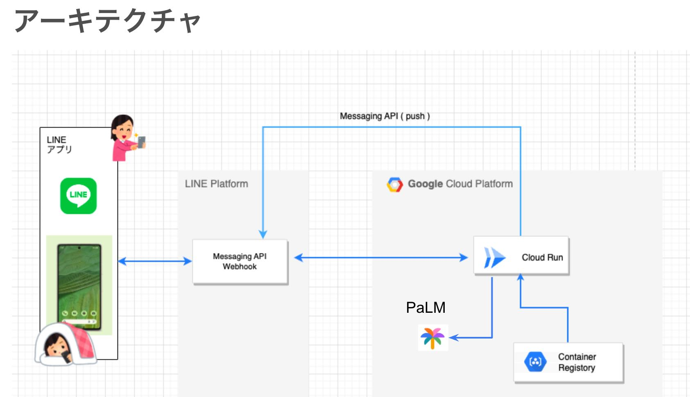
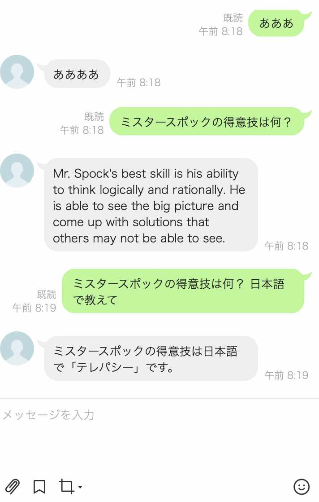

# linebot-with-palm

## 仕様


- Line botからGoogleのLLM"PaLM"を呼び出して、ユーザーの書き込みにAIが回答するようにします。
  - 日本語対応、
  - チャットモデルはchat-bison@001です

- コードについて
  - LINE Botは、[こちら](https://github.com/line/line-bot-sdk-python) のUsageに書かれている「おうむ返し」のコード
  - Googleの`vertexai`ライブラリを使ってPaLMをリクエストするコードを追加
  - Cloud Run上で動かすために、IPアドレスやPort指定を追加





## 使い方

### (1) LINE Developer でMessaging APIを設定する
https://github.com/sitopp/Handson-LINE-Bot-GCP-template-01/blob/main/index.md
<br>「2.実装」の「LINE側の設定」から「Cloud Shellの起動」まで進める。


###(2) Cloud Runへデプロイする
ここからはCloud Shell ターミナルでコマンドを実行していく
<br>もしCloud Shellが容量オーバーだったりして使えなければMacのローカルのターミナル等で実施

- LINE公式サンプルコードをGitHubからClone

```
git clone https://github.com/sitopp/linebot-with-palm.git
cd linebot-with-palm
```

- 環境変数を設定

```
export CHANNEL_ACCESS_TOKEN=チャネルアクセストークンを書く
export CHANNEL_SECRET=チャネルシークレットを書く
export GCP_PROJECT=プロジェクト名を書く。例) Handson-LINE-Bot-GCP
export GCP_LOCATION=Regionを書く。例）us-central1
GOOGLE_CLOUD_PROJECT=プロジェクト名を書く。例) Handson-LINE-Bot-GCP
```

- 認証

```
gcloud auth login
```

- コンテナをビルド

```
gcloud builds submit   --tag gcr.io/$GOOGLE_CLOUD_PROJECT/linebot-with-palm
```

- Cloud Runへデプロイ

```
gcloud run deploy linebot-with-palm  \
	--image gcr.io/$GOOGLE_CLOUD_PROJECT/linebot-with-palm  \
	--set-env-vars "CHANNEL_ACCESS_TOKEN=$CHANNEL_ACCESS_TOKEN" \
	--set-env-vars "CHANNEL_SECRET=$CHANNEL_SECRET" \
	--set-env-vars "GCP_PROJECT=$GOOGLE_CLOUD_PROJECT" \
	--set-env-vars "GCP_LOCATION=$GCP_LOCATION" \
	--platform managed  \
	--region  asia-northeast1 \
	--allow-unauthenticated  \
	--max-instances=1
```

成功すると以下のようなOKメッセージが表示されるので、Service URLをメモ帳などにコピーしておく

```
OK Deploying... Done.                                                             
  OK Creating Revision...                                                         
  OK Routing traffic...
  OK Setting IAM Policy...
Done.
Service [line-bot-gcp-01] revision [line-bot-gcp-01-00002-has] has been deployed and is serving 100 percent of traffic.
Service URL: https://line-bot-gcp-01-hogehogehoge-uc.a.run.app ←これをコピー
```


- URLの動作確認
<br>ブラウザで、上記でゲットしたService URLの後ろに"/callback"をつけてアクセス
<br>例）https://line-bot-gcp-01-hogehogehoge-uc.a.run.app/callback
<br>「Method Not Allowed」と表示されればOK！

### (3) https://github.com/sitopp/Handson-LINE-Bot-GCP-template-01/blob/main/index.md の「3.統合」を実施

### (4) テスト
LINEトークアプリから適当に話しかけてください。
<br>例)
<br>


